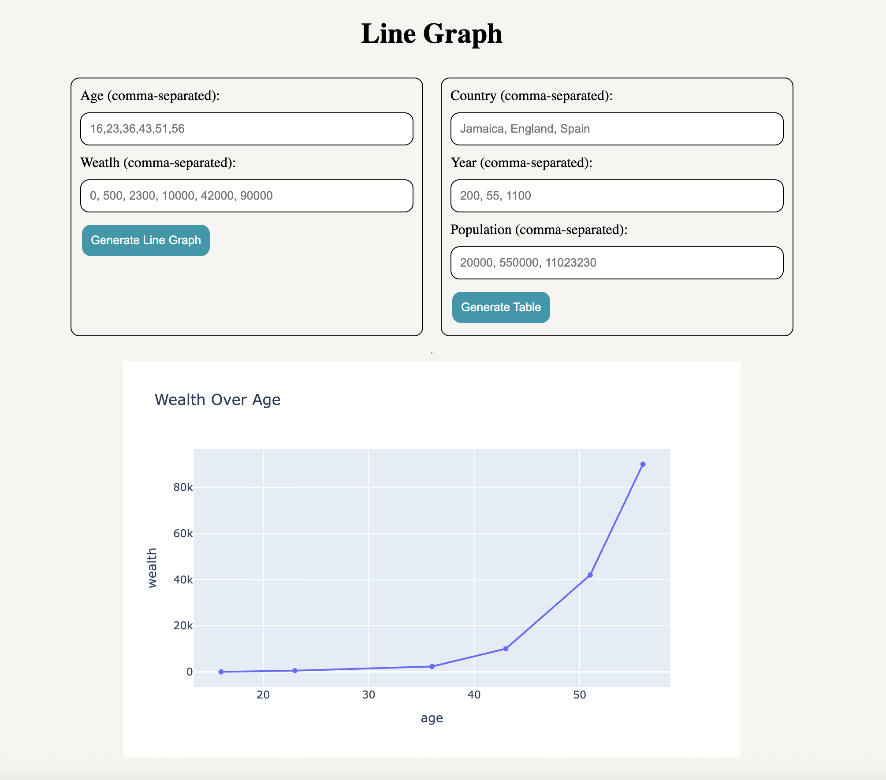
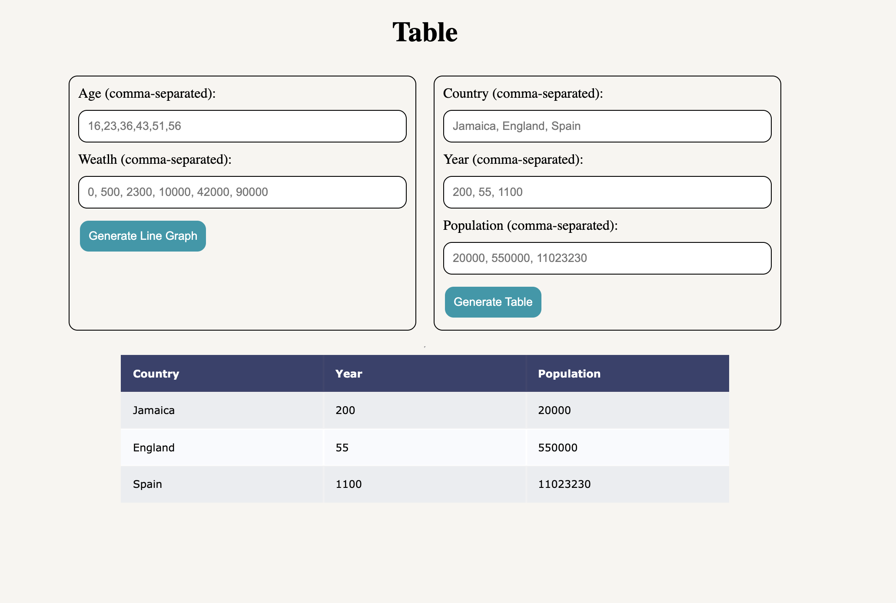

# Data with Flask
Mainly experimenting with Python. Got a great understanding of how powerful python is and what it can be used for especially with matplotlib and plotly graphs.

## My own Flask
- This is a quick extension from what I touched upon, allowing me to dive more into some of the other graphs/tables you can create with plotly.

## Images

### Line Graph

### Table

